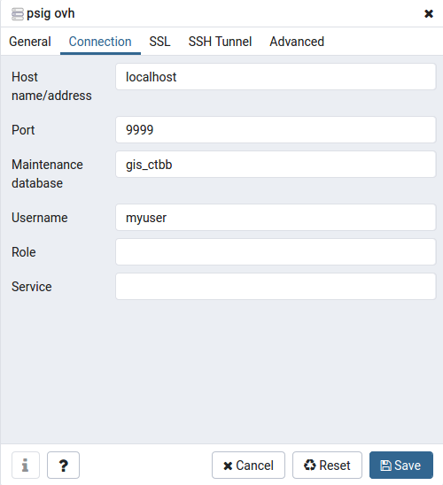
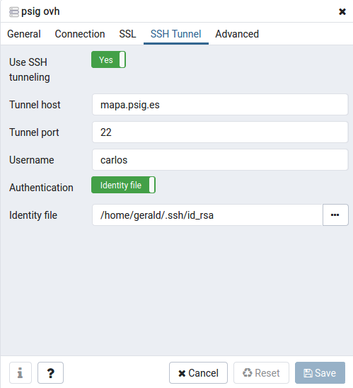
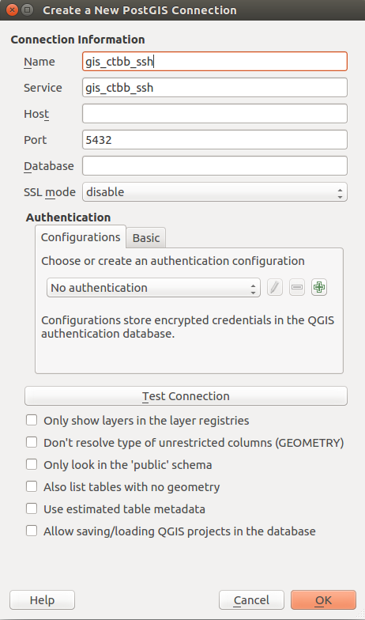

# Seguredad en servidores de mapas

## Cerrar puerto postgresql 5432

Para cerrar el acceso a postgresql desde Internet y permitirlo solamente desde localhost, hace falta modificar la siguiente línea en el archivo `/etc/postgresql/12/main/postgresql.conf`:

```
listen_addresses = 'localhost'
```

Después reencendem postgresql con `sudo service postgresql restart`.

## Impedir acceso por ssh con contraseña

Para impedir el acceso con contraseña, hace falta cambiar la siguiente línea en el archivo `/etc/ssh/sshd_config`:

```
PasswordAuthentication no
```

Después reencendem sshd con `sudo service ssh restart`.

Entonces hace falta añadir la clave pública de ssh `id_rsa.pub` al archivo `~/.ssh/authorized_keys`.

## Configurar acceso pgadmin y Qgis

### Configurar acceso fácil SSH

Creamos la configuración de SSH para que el acceso será fácil poniendo lo siguiente al archivo `~/.ssh/config`:

```
Host psig
    Hostname                 myhost.com
    Port                     22
    User                     myuser
    IdentityFile             ~/.ssh/id_rsa
    LogLevel                 INFO
    CheckHostIP              yes
```

### Tunel SSH genérico para pgadmin y Qgis

Luego hacemos un un tunel del puerto de postgresql remoto (5432) al puerto local 9999 desde la configuración ssh de la configuración psig:

```
ssh -L 9999:localhost:5432 psig
```

Mantenemos abierto esta sesión por la duración del acceso de pgadmin o Qgis.

### Configurar pgadmin4 para acceder con SSH Tunnel

Configuramos el acceso al servidor indicando host (localhost), port (9999), database (gis_ctbb) y usuario de la BDD:



**Alternativa**: En sistemas nuevos (depende del paquete python3-paramiko_2.4.1 o más nueva) es posible usar la configuración del tunel ssh de pgadmin. En este caso funciona añadir usuario y la llave privada al campo *Identity file* en la pestaña SSH tunnel:



### Configurar Qgis para acceder con SSH Tunnel

Configuramos un servicio para postgresql añadiendo lo siguinte al archivo `/etc/postgresql-common/pg_service.conf`:

```
[gis_ctbb_ssh]
host=localhost
port=9999
dbname=gis_ctbb
user=myuser
password=mypasswd
```

Luego creamos una nueva conexción de PostGIS usando solamente el servicio `gis_ctbb_ssh`. Con eso tenemos acceso remoto a la BDD.

